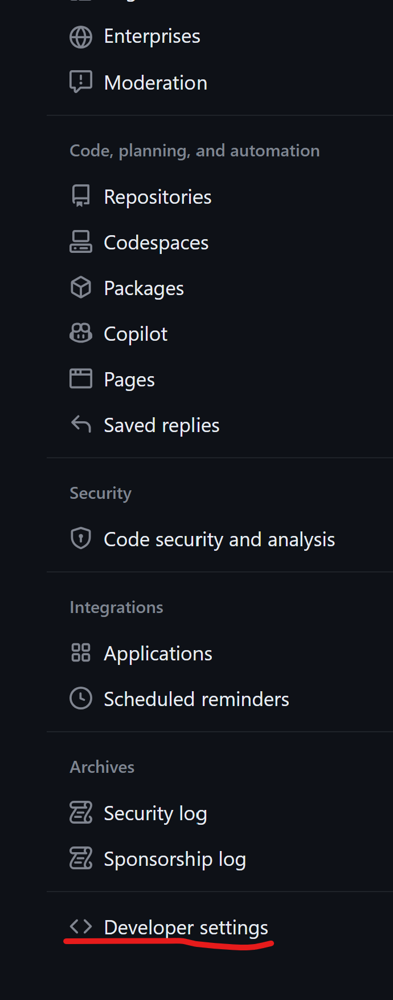
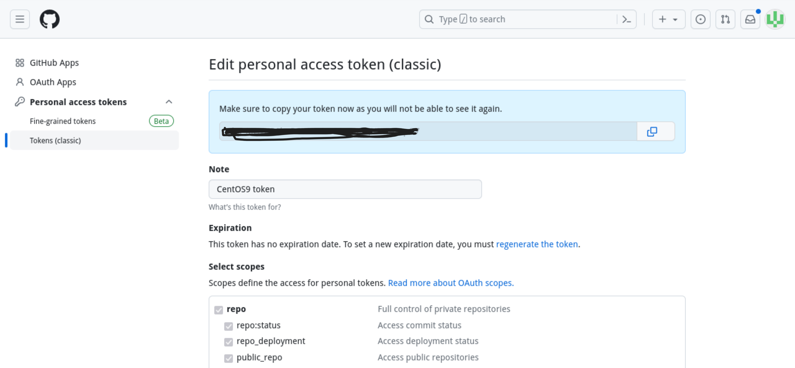

### 1. GitHub clone

bring data to my local environment 
    
    git clone [repository]

 _Respository have to GitHub storage URL_ 


> It can happen an authentication error when cloning a repository, then go to the GitHub page and issue a token for authenticates
{: .prompt-warning }


#### # How to issue the token
1. Go to `Settings` from the menu that appears when you click user icon which is top right on your Github page
2. Click a `developer settings`

<br>


3. Issue a token applying permissions users want
<br>

🔶 Entering a token value instead of a password after entering an ID when asked to authenticate a user <br>


### 2. Add

Add changes from the working directory to the staging area

```console
git add --all
```


### 3. commit
* Use to save changes until the next commit
* Send changes to remote
```console
git commit -m [commit massage]
```

### 4. push

submit and publish the changed data
```console
git push -u origin main
```


<br><br>
pref:<br>
emoji:d<a href="https://gist.github.com/rxaviers/7360908" style="color:gray"><i>https://gist.github.com/rxaviers/7360908</i></a>


    
