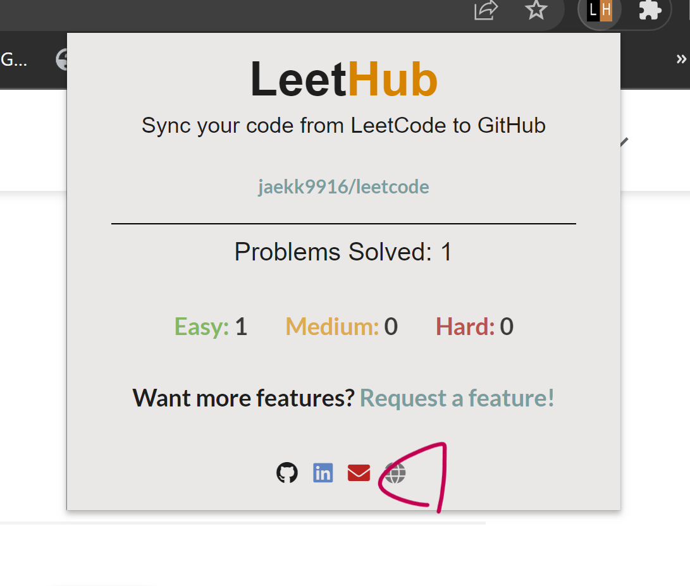

## LeetCode Github Integration

### 1. Visit the ```chrome-extension://aciombdipochlnkbpcbgdpjffcfdbggi/welcome.html```

<br /><br />

### 2. Click the plugin Icon



<br /><br />

### 3. Write you repository name


<br /><br />

### 4. Connect github with LeetHub


<br /><br />
                                                   
### 5. Complete


                                                   
                                                  
